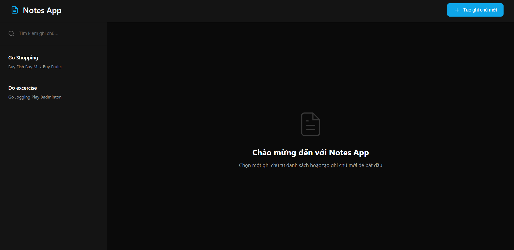

# Notes App

A modern web-based notes management application with a **RESTful API backend** and **responsive dark mode UI**.  


---

## Features

- **CRUD Notes**: Create, view, edit, delete notes
- **Search notes** by keywords
- **Dark mode** and **responsive design**
- **REST API backend** built with Node.js + Express
- Data stored in JSON file system
- Auto reload server with `nodemon` during development

---

## Tech Stack

- **Backend**: Node.js, Express.js
- **Frontend**: HTML5, CSS3, Vanilla JavaScript
- **UI/UX**: Responsive layout, Dark mode, Modern styling
- **Storage**: JSON file system
- **Dev Tools**: nodemon

---

## Installation & Usage

Clone the repository:

```bash
git clone https://github.com/jaygray20033/notes-app.git
cd notes-app
```

Install dependencies:

```bash
npm install
```

Run the server:

```bash
npm start
```

Development mode (auto reload):

```bash
npm run dev
```

Open your browser at: http://localhost:3000

## 🎨 UI Highlights

- Sidebar with search and note list
- Main editor for viewing and editing notes
- Toast notifications for success/error feedback
- Fully responsive for both desktop and mobile

---

## 🔮 Future Improvements

- [ ] Migrate storage to a database (MongoDB / PostgreSQL)
- [ ] Add user authentication (JWT)
- [ ] Enable cloud sync across devices
- [ ] Export / import notes (JSON, CSV)
- [ ] Deploy on Vercel / Render / Railway

---

## 👨‍💻 Author

- **Nguyen Quyet**
- 📧 Email: your-email@example.com
- 🌐 Portfolio / LinkedIn / GitHub

---

**Personal Project: Notes App – Fullstack Developer**  
_03/2025 – 05/2025_

Built a modern web-based notes management application with RESTful API and responsive UI.

1. **Frontend**: Developed with HTML5, CSS3, and Vanilla JavaScript. Implemented responsive layout, dark mode UI, and interactive note editor with live search.
2. **Backend**: Built RESTful APIs using Node.js and Express.js. Implemented CRUD operations (create, read, update, delete) with structured error handling.
3. **Storage**: Used JSON file system for persistent data storage and retrieval.
4. **Integration**: Designed reusable components, toast notifications, and optimized UI for both desktop and mobile experiences.

**Live Demo**: http://localhost:3000  
**GitHub Repo**: https://github.com/your-username/notes-app
